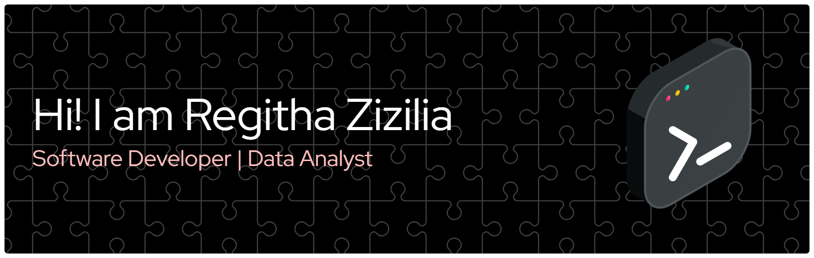

<h1 align="center">Hi there, I'm Regitha! 👋</h1>

  :computer: Software Developer | :bar_chart: Data Analyst | :brain: Software and Documentation Enthusiast

💬 I’m a Computer Science graduate with experience in website development, software documentation, and sentiment analysis. Currently focusing on improving my front-end development skills while expanding my knowledge in building interactive and informative data analysis dashboards 💬

:pushpin: Tech Stack

  
  
  
  
  
  
    

<!--
**regithazizilia/regithazizilia** is a ✨ _special_ ✨ repository because its `README.md` (this file) appears on your GitHub profile.

Here are some ideas to get you started:

- 🔭 I’m currently internship on Balai Besar Standardisasi dan Pelayanan Jasa Industri Bahan dan Barang Teknik
- 🌱 I’m currently learning Next.js

-->
